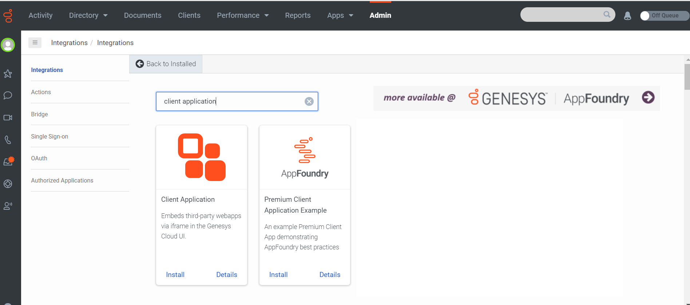
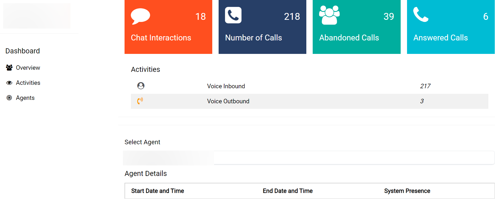

This Genesys Cloud Developer Blueprint explains how to use the analytics app to gather performance data and analyze the efficiency of the contact centers. Users can gain insights on agents and interaction data. The app also provides historical details of the contact centers on a dashboard such as Number of calls, Agent Details, Number of Interactions,etc. This app can also serve as a sample dashboard that can later be customized.  

## Solution Components

* **Analytics Query Builder** - A user interface-based developer tool that helps create analytics queries. Based on the chosen analytics criteria, the tool generates an analytics query that it runs against the Genesys Cloud Analytics API to return a JSON query result (for author: In the form of a JSON file?) from the Genesys Cloud organization. You can later use this JSON query in your applications.
* **Analytics app** - Audit-style dashboard of records that capture granular details on agent and customer interactions.

### Software development kits (SDKs)

* **Genesys Cloud Platform API SDK** - Client libraries used to simplify application integration with Genesys Cloud by handling low-level HTTP requests. We use the Genesys Cloud Platform API SDK to retrieve the necessary historical data of agent and customer interactions.

* **Javascript SDK** - A JavaScript library used to interface with the Genesys Cloud Platform API.

## Prerequisites

Implementing this solution requires experience in several areas or a willingness to learn:

- Administrator-level knowledge of Genesys Cloud and the Genesys AppFoundry
- Experience using the Genesys Cloud Platform API knowledge

### Genesys Cloud account

A solution requires a Genesys Cloud license. For more information, see [Genesys Cloud Pricing](https://www.genesys.com/pricing "Opens the pricing article"] in the Genesys Cloud Resource Center.
Master Admin role. For more information, see the [Roles and permissions overview](https://help.mypurecloud.com/?p=24360 "Opens the Roles and permissions overview article") in the Genesys Cloud Resource Center.

## Implementation steps
* [Clone the GitHub repository](#clone-the-repository-containing-the-project-files "Goes to the Download the repository from GitHub section")
* [Generate an OAuth token to access Genesys Cloud data](#generate-an-oauth-client-token-implicit-grant-in-genesys-cloud "Goes to the Creation of OAuth client section")
* [Host and run the Nodejs.app server locally](#host-and-run-the-nodejs.app-server "Goes to the Host and run Nodejs.app server locally section")
* [Install and activate the Analytics Detailed Record Metrics App in your Genesys Cloud Platform](#install-and-activate-the-analytics-detailed-record-metrics-app-in-your-genesys-cloud-platform "Goes to app activation and installation inside Genesys Cloud section")
* [Test the solution](#test-the-solution  " Goes to the Testing if the solution was set up successfully section")

### Clone the GitHub repository 

* Clone the [generate-detail-record-metrics-blueprint](https://github.com/GenesysCloudBlueprints/analytics-detail-record-metrics-blueprint "Opens the generate-detail-record-metrics-blueprint repository in GitHub") to your local machine.

### Generate an OAuth token to access Genesys Cloud data
1. Create an OAuth client. For more information, see [Create an OAuth client](https://help.mypurecloud.com/articles/create-an-oauth-client/ "Opens the Create an OAuth client article") in the Genesys Cloud Resource Center. This article outlines the procedure to authorize apps to receive a token to make requests to the Genesys Cloud Platform API.
2. After the OAuth client creation is complete, click **Client Details** and select **Token Implicit Grant (Browser)**. 
3. In the **Authorize Redirect URIs** section, add `http://localhost:3000`. 
 
4. Open the downloaded code sample, and in the [config.js file](https://github.com/jenissabarrera/generate-detail-record-metrics-blueprint/blob/main/docs/scripts/config.js), add the clientID you generated. 
5. Specify the region of your Genesys Cloud organization. For example, `mypurecloud.com, mypurecloud.au`.

### Host and run the Nodejs.app server locally

:::This procedure requires the latest Node.js version.:::

1. To install the latest Node.js version, open the command line in the directory where you want to save the project and type `npm install -g n latest`.
2. To install the node modules, go to the directory where the files are and type `npm install` in the command line.  
3. To run the server locally, type `node index.js` in the command line. 
4. To check if the app is successfully working on your localhost, go to your browser and open http://localhost:3000/.

### Install and activate the analytics app in your Genesys Cloud platform

1. Go to your Genesys Cloud organization and open **Admin** > **Integration**. 
2. Search for **Client Application** and click **Install**. 
3. Go to the **Details** tab and do the following:
    3.1 Rename the integration to a preferred name.
    3.2 Enable the toggle to **Active**.
 
4. Go to the **Configuration** tab and do the following:
    4.1 Change the **Application URL** value to `http://localhost:3000/?conversationid={{pcConversationId}}&language={{pcLangTag}}`. 
    4.2 On the group filtering, add the groups which contain the users of this app. 
   
4. Click **Save**.

### Test the solution

1. From the **Apps** menu and open the analytics app that is available on the name you had saved. The app dashboard opens. From the dashboard, you can see basic conversation details such as number of chats, calls, abandoned calls, and other details for a set date range. 
  
2. From the **Select Agent** field, choose the name of the agent whose details you require to see. The agent performance details appear. 
   
3. To modify the query, use the [Analytics query builder](https://developer.genesys.cloud/developer-tools/#/analytics-query-builder "Opens the Developer Tools page") and generate the body and the date format for each query. 

## Additional Resources
* [Genesys Cloud Developer Center](https://developer.mypurecloud.com/)
* [Analytics Query Builder developer tool quick start](https://developer.mypurecloud.com/gettingstarted/developer-tools-analytics-query.html)
* [Analytics Overview](https://developer.mypurecloud.com/api/rest/v2/analytics/overview.html#:~:text=Genesys%20Cloud%20provides%20a%20rich,performance%20and%20customer%2Fagent%20interactions.)