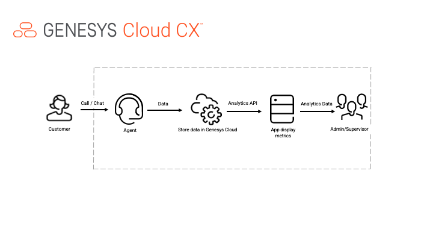
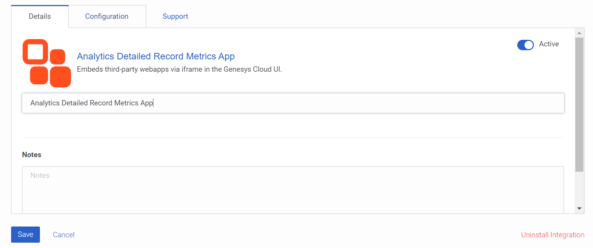
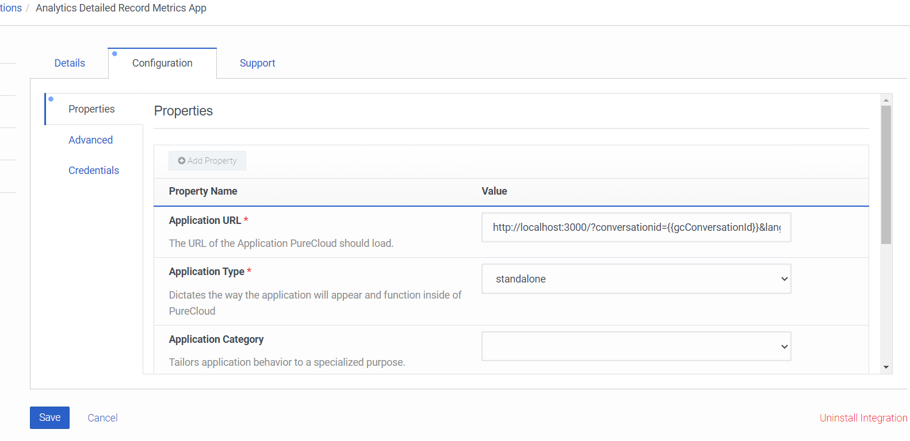

This Genesys Cloud Developer Blueprint solution provides an Analytics Detailed Record Metric app that gathers performance data via the analytics API and enables an admin or supervisor to analyze the efficiency of their contact center. By using this app, administrators can gain insights on agents and interaction data. The app also provides a dashboard that shows historical details such as Number of calls, Agent Details, Number of Interactions, and so on. The Analytics Detailed Record Metric app can also serve as a sample dashboard that can also be customized to show other metrics.  

## Solution components

* **Analytics Query Builder** - A user interface-based developer tool that helps create analytics queries. Based on the chosen analytics criteria, the tool generates an analytics query that it runs against the Genesys Cloud Analytics API to return a JSON query result from the Genesys Cloud organization. You can later use this JSON query in your applications.
* **Analytics Detailed Record Metric app** - Audit-style dashboard of records that presents granular details of agent and customer interactions.

### Software development kits (SDKs)

* **Genesys Cloud Platform API SDK** - Client libraries used to simplify application integration with Genesys Cloud by handling low-level HTTP requests. We use the Genesys Cloud Platform API SDK to retrieve the necessary historical data about agent and customer interactions.

* **Platform API Client SDK-JavaScript** - A JavaScript library used to interface with the Genesys Cloud Platform API.

## Prerequisites

- Administrator-level knowledge of Genesys Cloud
- Experience using the Genesys Cloud Platform API 

### Genesys Cloud account

* A Genesys Cloud license. For more information, see [Genesys Cloud pricing](https://www.genesys.com/pricing "Opens the Genesys Cloud pricing page"] on the Genesys website.
* (Recommended) The Master Admin role in Genesys Cloud. For more information, see [Roles and permissions overview](https://help.mypurecloud.com/?p=24360 "Opens the Roles and permissions overview article") in the Genesys Cloud Resource Center.

## Implementation steps
* [Clone the GitHub repository](#clone-the-repository-containing-the-project-files "Goes to the Clone the GitHub repository section")
* [Generate an OAuth token to access Genesys Cloud data](#generate-an-oauth-client-token-implicit-grant-in-genesys-cloud "Goes to the Generate an OAuth token to access Genesys Cloud data section")
* [Host and run the Nodejs.app server locally](#host-and-run-the-nodejs.app-server "Goes to the Host and run the Nodejs.app server locally section")
* [Install and activate the Analytics Detailed Record Metrics App in your Genesys Cloud Platform](#install-and-activate-the-analytics-detailed-record-metrics-app-in-your-genesys-cloud-platform "Goes to app activation and installation inside Genesys Cloud section")
* [Test the solution](#test-the-solution  "Goes to the Test the solution section")

### Clone the GitHub repository 

* Clone the [analytics-detail-record-metrics-blueprint](https://github.com/GenesysCloudBlueprints/analytics-detail-record-metrics-blueprint "analytics-detail-record-metrics-blueprint repository in GitHub") to your local machine.

### Create an OAuth client in Genesys Cloud

1. Log in to your Genesys Cloud organization.
2. Create an OAuth client that uses the Token Implicit Grant (Browser) grant type. For more information, see [Create an OAuth client](https://help.mypurecloud.com/?p=188023 "Opens the Create an OAuth client article") in the Genesys Cloud Resource Center.
3. Add your hosted site to the **Authorize Redirect URIs** box. For example, `http://localhost:3000`. 
 
4.Modify the [config.js file](https://github.com/GenesysCloudBlueprints/analytics-detail-record-metrics-blueprint/blob/main/src/scripts/config.js), file with the Client ID for the OAuth client. The Client ID is passed into `loginImplicitGrant`.
5. Specify the region of your Genesys Cloud organization. For example, `mypurecloud.com, mypurecloud.au`.

### Host and run the Nodejs.app server locally

:::primary
**Note**: This blueprint solution requires the latest Node.js version.
:::

1. To install the latest Node.js version, from a command line, navigate to the directory where you want to save the project and type `npm install -g n latest`.
2. To install the node modules, from a command line, navigate to the directory where the files are and type `npm install`.  
3. To run the server locally, from a command line, type `node index.js`. 
4. To check if the app is successfully working on your localhost, use your browser window to go to http://localhost:3000/.

### Install and activate the Analytics Detailed Record Metric app in your Genesys Cloud organization

1. Log in to your Genesys Cloud organization and go to **Admin** > **Integration**. 
2. Search for **Client Application** and click **Install**. 

3. Click the **Details** tab.
4. Rename the integration to a preferred name.
5. Set the toggle to **Active**.
 
6. Click the **Configuration** tab.
7. Change the **Application URL** value to `http://localhost:3000/?conversationid={{gcConversationId}}&language={{gcLangTag}}`. 
8. Under **Group Filtering**, select the groups that contain the users of this app. 
   
9. Click **Save**.

### Test the solution

1. From the Genesys Cloud **Apps** menu, open the Analytics Detailed Record Metric app. If you renamed the app, look for its new name. 
  
2. From the Analytics Detailed Record Metric app dashboard, review basic conversation details such as number of chats, calls, abandoned calls, and other details for the date range you specify. 
  
3. From the **Select Agent** field, choose the name of the agent whose details you require to see. The agent performance details appear. 
   
4. To modify the query, use the [Analytics query builder](https://developer.genesys.cloud/developer-tools/#/analytics-query-builder "Opens the Developer Tools page") and generate the body and the date format for each query. 

## Additional resources
* [Genesys Cloud Developer Center](https://developer.genesys.cloud/ "Goes to the main page of the Genesys Cloud Developer Center)
* [Analytics Query Builder developer tool quick start](https://developer.genesys.cloud/guides/quickstarts/developer-tools-analytics-query "Goes to the Analytics Query Builder Dev Tool page)
* [Analytics Overview](https://developer.genesys.cloud/api/rest/v2/analytics/overview "Goes to the Analytics Overview page)
* [Analytics GitHub Repository] (https://github.com/GenesysCloudBlueprints/analytics-detail-record-metrics-blueprint) "Goes to the analytics-detail-record-metrics-blueprint repository in GitHub)
